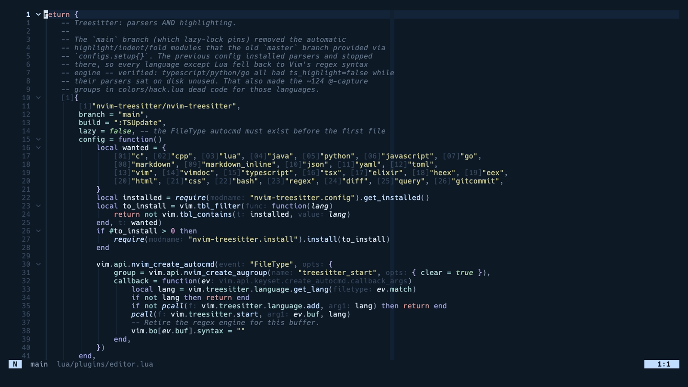
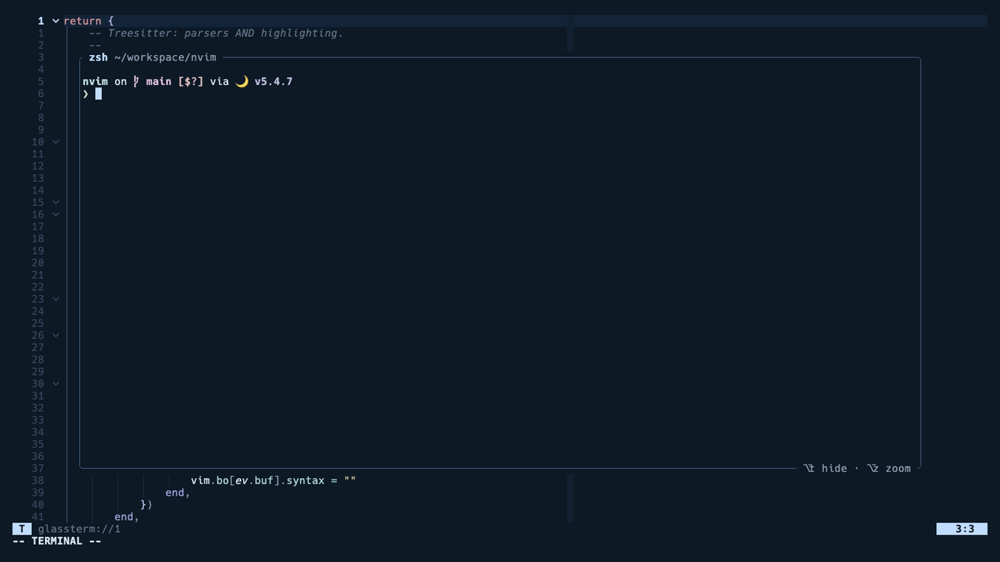

# nvim

My Neovim config. Built for living in the terminal and working with coding
agents without leaving it.



Neovim 0.11 or newer, lazy.nvim, and a theme that matches ghostty's Blazer.
Three plugins of mine do the agent part. The agent runs in a float over the
editor, its edits show up live in whatever file you have open, and you review
them like a pull request and send the comments straight back.

## Setup

You need these before the first launch.

| | |
|---|---|
| Neovim 0.11+ | `brew install neovim` |
| git, ripgrep, make and a C compiler | for plugins, search and the fuzzy matcher |
| a Nerd Font | the config uses [Hack Nerd Font](https://www.nerdfonts.com/font-downloads) |

Then

```bash
mv ~/.config/nvim ~/.config/nvim.bak   # if you have one
git clone https://github.com/skhan75/nvim ~/.config/nvim
nvim
```

The first launch installs lazy.nvim, every plugin, the treesitter parsers and
the language servers. Give it a minute, then restart once.

Nice to have, each one picked up automatically if it is on your PATH.

| | |
|---|---|
| `fd` | faster file finding |
| `node` | markdown preview and the JavaScript servers |
| `go` | the Go server and debugger |
| `ruff` | Python formatting and linting, `brew install ruff` |
| `claude` | the agent keys below |

Two things to know on a Mac. The Alt keys need your terminal to send Option
as Alt, which in ghostty is `macos-option-as-alt = left`. And the theme is
transparent, so it expects a terminal with some opacity. Set
`vim.g.blazer_transparent = false` in `init.lua` for a solid background.

## Working with agents

This is the part that is different from most configs.



| Key | What it does |
|---|---|
| `Alt+t` | toggle the agent's terminal, a float that is already running ([glassterm](https://github.com/skhan75/glassterm.nvim)) |
| `Alt+z` | zoom it |
| `]d` `[d` | jump between edits the agent made to your open file, shown live in red and green ([tailf](https://github.com/skhan75/tailf.nvim)) |
| `<leader>v` | list the files the agent touched, with the changes beside them ([volley](https://github.com/skhan75/volley.nvim)) |
| `<leader>va` | comment on the line or selection under the cursor |
| `<leader>vs` | send every comment back into the agent's session |
| `<leader>ts` | send the visual selection to the terminal |
| `<leader>tr` | rerun the last command |
| `Alt+a` | a plain Claude sidebar, if you want a split instead of a float |

The three plugins are loaded from `~/workspace` when that checkout exists,
so I can work on them, and from GitHub on any other machine. You do not have
to do anything.

## Keys

Leader is space. `<leader>fk` searches every keymap, and which-key shows the
groups if you pause after the leader. The ones I reach for most:

| Group | Keys |
|---|---|
| Find | `<leader>ff` files, `fg` grep, `fb` buffers, `fo` recent, `fw` word under cursor, `<leader><leader>` buffers |
| Git | `<leader>gp` preview hunk, `gh` stage hunk, `gu` reset hunk, `gB` blame, `gD` diffview, `]h` `[h` next and previous hunk |
| Code | `<leader>cf` format, `co` outline, `gd` definition, `gD` type definition, `K` hover, `grn` rename, `gra` code action |
| Split and join | `<leader>js` split a block onto lines, `jj` join it back |
| Search and replace | `<leader>sr` project wide, `sw` word under cursor, `sf` this file |
| Diagnostics | `<leader>xx` all, `xX` this buffer, `<leader>le` this line |
| Tests | `<leader>nn` nearest, `nf` file, `ns` summary, `nd` debug nearest |
| Debug | `<leader>db` breakpoint, `dc` continue, `di` `do` `dO` step, `du` the UI |
| Harpoon | `<leader>ha` add, `hh` menu, `Alt+1` to `Alt+4` jump |
| Sessions | `<leader>pp` restore, `pl` last, `pd` stop saving |
| Windows | `Ctrl+h j k l` move, `Ctrl+arrows` resize, `<leader>z` zen, `<leader>Z` zoom |
| Lines | `Alt+j` `Alt+k` move a line or selection |

A few defaults are rebound on purpose. `s` and `S` are flash jumps, not
substitute. `]d` and `[d` are tailf, not diagnostics. `gR` is Trouble's
references, not virtual replace.

## Theme

Two colorschemes, both local, no plugin.

`blazer` is the default. Navy and muted pastels, matching ghostty's built in
Blazer theme, transparent. `hack` is the older one, teal on black, opaque.
`:colorscheme hack` switches, and both feed the same statusline.

## Layout

```
init.lua            leaders, options, colorscheme, lazy, keymaps, in that order
lua/config/         options.lua, keymaps.lua, lazy.lua, compat.lua
lua/plugins/        one file per area, each returns lazy specs
lua/theme.lua       every highlight group, shared by both colorschemes
colors/             the two palettes
lazy-lock.json      pinned plugin versions
```

## Plugins

Editing is treesitter, blink.cmp with LuaSnip, autopairs, surround, flash,
treesj and todo-comments. Finding is telescope with fzf-native, a file
browser and projects, plus harpoon. Language support is Mason with
nvim-lspconfig for twelve servers, conform for formatting, nvim-lint for
what the servers miss, nvim-dap for Go and Python, and neotest for Go,
Python, Jest and Elixir. Git is gitsigns and diffview. The rest is snacks
for the dashboard, notifications, indent guides and zen mode, lualine,
which-key, trouble, grug-far, persistence, undotree, aerial and markdown
preview.

Everything loads lazily unless it says otherwise in its spec.

## Good to know

- Format on save is on. Python needs `ruff` installed by hand, since I keep
  it out of Mason on purpose.
- `compat.lua` shims a couple of APIs that a 0.12 nightly advertises but does
  not ship. It turns itself off on other builds and can be deleted after 0.12
  is released.
- `<leader>fp` lists projects under `~/workspace` if you have one, otherwise
  under your home directory.
